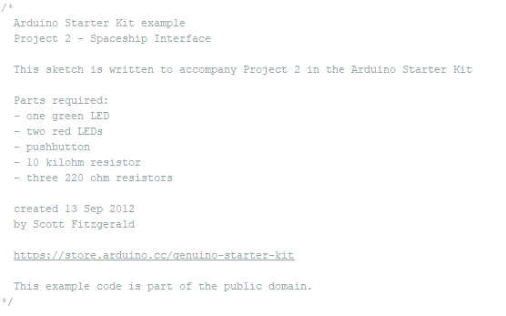
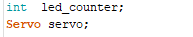
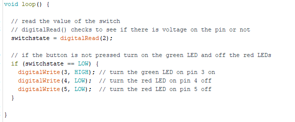

# Combining Sketches  | [HOME](README.md) |

When combining two or more sketches, it is VERY important that you understand the various sections of the sketch,
the next part of this guide is describing these sections.

You can skip over this, then come back later and read it when your combined sketches don’t work.

# Arduino basic sketches have sections

## Block comments

These can appear anywhere in the code but usually appear at the top with the author, description etc.

**Example**



The block comments start with /\*and end with\*/

A single line comment starts with //

When combining sketches, you can ignore the comment lines and comment blocks if you want as Arduino code ignores these.

## Libraries Include Section

This section appears at the very top of the sketch.
### note: 
##### *(there are some VERY special cases where a library may have a directive required before the library is loaded. This is very unusual but can happen.  It will appear are a #define XXXXXXX before the include library statement)*

The library load/include command is in the form of:

```#include <library file name>```
  
This will load and include the library if it is in the standard library path. If you load a library using the library manager, then the library will be in the correct place to be loaded with this statement.

In special cases, the library include statement might be in the form of:

```#include "library file name"```

In this case the library file is not in the normal location. 
If it is in the same directory as the sketch, then it will use this format.
*It may also have the full path to the file as well, but this is a special case.*

## Definition Section

Usually, a sketch will have constants here. These are variables that do not change.

**Example**


### Note: 
##### *there are no semi colons after a define.*

## Global Variables

A variable that changes and is used though out the sketch has a global scope. This means the variable can be accessed anywhere in the sketch.

**Example**




## Functions

This is a section that may or not be in the sketch. Usual coding practice is to have any functions that are used in the sketch located here.

These functions may be simple or complex.

**Example**


In the program, you would call this function with


## Setup

This is a special section that runs once when the Arduino starts.

In this there are commands to start devices and or libraries.
Setup serial ports basically anything that needs to be done ONCE when the Arduino starts


**Example**


## Loop

This is the section that runs all the time after setup.
Once setup has run, loop runs continuously. This is where your main code will be.

**Example**


