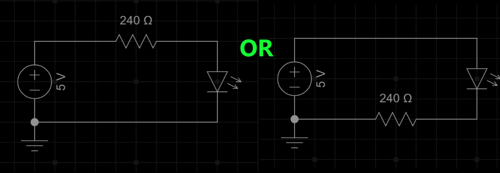

# Proper way to use an LED

## Contents:

---

[What is an led?](#an-led-is-short-for-a-light-emitting-diode)

[Correct Single LED Wiring](#correct-wiring)

[Seven Segment Displays](#seven-segment-displays)

[LED Color Matters](#led-color-matters)

[Math for a Resistor](#resistor-math-time)

---

## An LED is short for a Light Emitting Diode

### Diodes are devices that let electricity flow only in one direction. LEDs work the same way as they are also diodes.

#### When you connect an LED to a circuit you have a direct link from one leg of the diode to the other.  LEDs can not process large amounts of current, they are limited to 20ma or less. Although they may try and pass the full current, doing so will cause the LED and arduino pin to damage or shorten its performance efficiency. *or dammage/shorten the life of a pin on the arduino*

#### To stop this from happening, we use a resistor. This limits the amount of current flowing through the LED so it lights and doesn't burn out.

---

## Correct Wiring

#### It does not matter for a single LED whether you apply the resistor to the GND or the power side.  So this is how you would wire a standard LED

---

## Seven Segment Displays

#### Seven segment displays are a specific case. You **should** have your resistors on every segment of the display. You will require 7-8 resistors depending upon if your display uses decimal or not.

---

#### You do not want to use a resistor on the common pin of the display. The reason for this is found in math. If you look at the example above you can see that each segment only has 8ma passing through it. No matter if 1 segment is lit up, or if all 7 are, each one is limited and controlled to 8ma. If you place a resistor on the collector, then the ma will change each time a segment is lit. With one segment lit up, there will be 8ma passing through it, when you light 2, then the segments will get dimmer because there is only 4ma passing through each one. if you light all 8 segments then you will only have 1ma passing through each one of them. This is why we do not use a resistor on the single common pin.

# LED Color Matters

#### Each led has its forward voltage. Forward voltage is the required voltage level that the lead needs before it starts conducting through it. Below is a chart of the common colors forward voltage requirements. If you can find a data sheet for your led it is best to go by that. If not the chart will assist you in your resistor math.

# Resistor Math Time

## _We will use the chart in our examples._

#### If you have a supply voltage of 5v, and you have a red led, we will say the forward voltage is 1.8v. So first we subtract the FV \(forward voltage\) from the total voltage. So it would look like this.

#### Then we will take that newfound voltage and find out the resistor we require. We will be calculating for 10ma or less, so the lead will not burn out faster than expected, so this is the math for that.

#### As you can see the perfect resistor value would be 320 Ohms. If you don't have a resistor for that value you can use the next size larger than it, OR you can put 2 smaller resistors end to end and use them that way.

**EXAMPLE:** _220-ohm resistor and a 220-ohm resistor can make a 440-ohm resistor._

### There is also a [resistor calculator](https://ohmslawcalculator.com/led-resistor-calculator "resistor online calculator") you can use if you have the data for your led.
