# Combining Sketches { .text-[#e67e22] }

[← Back to Home](../index.md)

*This page is about combining multiple Arduino sketches into one.*

This section describes how to identify and combine the different parts of Arduino sketches.

::: tip Sketch Sections
Arduino basic sketches have sections:

* Block comments
* Single line comments
* Library Include Section
* Definition Section
* Global Variables
* Functions
* Setup
* Loop

Let's look at each of these sections in more detail.
:::

## Block comments

These can appear anywhere in the code. You will see them appear the most at the top with the author, description, etc.

Comments are ignored by the Arduino compiler. They are there to help you understand the code.

They can be used to temporarily disable code. This is useful when you are testing a section of code and you want to disable the rest of the code.

**Example**

```cpp
/*
 * This is a block comment
 */
```

The block comments start with `/*` and end with `*/`.

## Single line comments

A single line comment starts with `//` and ends at the end of the line.

**Example**

```cpp
// This is a single line comment
```

When combining sketches, you can ignore the comment lines and comment blocks, if you want, as Arduino code ignores these.

## Libraries Include Section

This section appears at the very top of the sketch.

::: info Special Cases

There are some **very special cases** where a library requires a directive before it can be loaded. This is unusual but can happen — it appears as a `#define` statement before the include:

```cpp
#define SOME_PIN 20
```

or

```cpp
#define SOME_VALUE
```

The `#include` command loads libraries in the standard path:

```cpp
#include <library file name>
```

If the library file is in your sketch's directory (not the standard library path), you can use quotes:

```cpp
#include "library file name"
```

This is the only exception — normally, libraries should be in the standard library path and use angle brackets.
:::

## Definition Section

Usually, a sketch will have constants here. These are variables that do not change.

**Example**

```cpp
#define led_pin 13
#define num_leds 20
```

> **Note**: `#define` statements are preprocessor directives and **do not** use semicolons.

## Global Variables

A variable that is declared above `setup()` may or may not change value over time, and is used throughout the sketch — it has a global scope. This means the variable can be accessed anywhere in the sketch.

**Example**

```cpp
int led_counter = 10;     // this is a global variable
int led_counter;          // with no initial value
Servo myservo(servo_pin); // this is a global object
```

## Functions

This is a section that may or may not be in the sketch. Usual coding practice is to have any functions that are used in the sketch located here.

These functions may be simple or complex.

**Example**

```cpp
void blinkLED() {
    digitalWrite(led_pin, HIGH);
    delay(1000);
    digitalWrite(led_pin, LOW);
    delay(1000);
}
```

In the program, you would call this function with:

```cpp
blinkLED();
```

## Setup

```cpp
void setup() {
    Serial.begin(9600);
}
```

This is a special function that runs once when the Arduino starts.

Here, we place commands to start devices and/or libraries. Set up serial ports — basically anything that needs to be done **once** when the Arduino starts.

**Example**

```cpp
void setup() {
    Serial.begin(9600);       // start serial port
    pinMode(led_pin, OUTPUT); // set LED pin to output
    pinMode(2, INPUT);        // set switch pin to input
    servo.attach(servo_pin);  // attach servo to servo pin
}
```

## Loop

This is the section that runs all the time after setup.

Once setup has run, loop runs continuously. This is where your main code will be.

**Example**

```cpp
void loop() {
    bool switchstate = digitalRead(2); // read switch state
    if (switchstate == HIGH) {
        digitalWrite(3, HIGH);         // turn on LED
        digitalWrite(4, LOW);          // turn off LED
        digitalWrite(5, LOW);          // turn off LED
    }
}
```

In this lesson on combining sketches, we will be using two sketches from the examples for two libraries.

One from LiquidCrystal Library:


The other from Adafruit DHT Sensor Library:

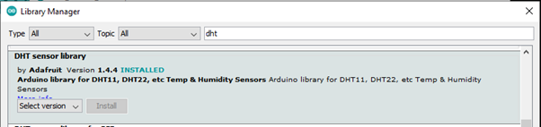

This is the first file, called `DHT_Unified_Sensor`:

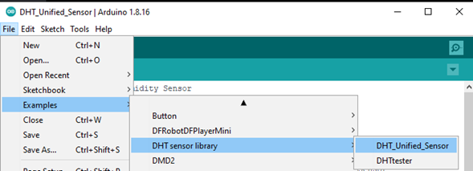

This is the second file, called `Hello World`:


These files are accessible via the **File > Examples** menu as shown — **after** you load the libraries using the Library Manager.

Here are the two files side by side. With the IDE you can open two files and set them up side by side. Basically open the IDE twice.

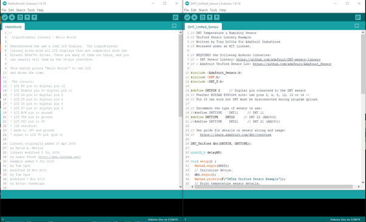

In each file there is a large comments block. To tidy up, we will remove them. This is optional.

This gives us the two files in a form that is a little easier to work on:

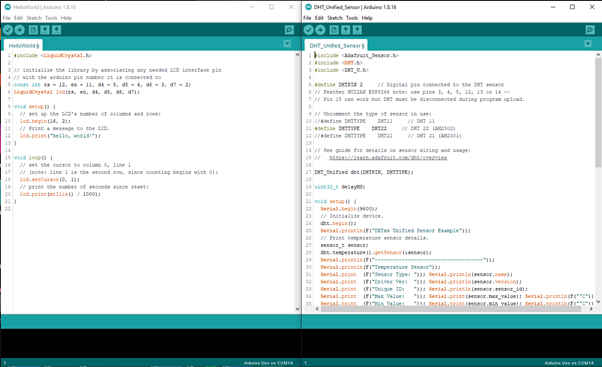

First up, we copy the library load section:

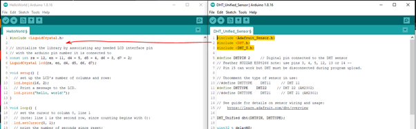

This is the section copied from the right file to the left file:

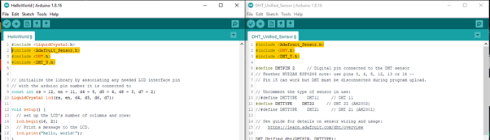

The next section is the Definition Section.

In these particular files, there are definitions in only one file. We copy from the right side to the left side sketch.
Check that there are no definitions with the same names and/or different values.

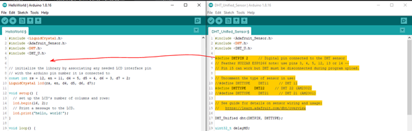

This is the section copied from the right file to the left file:

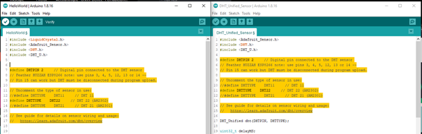

Next is the Global Variables Section:

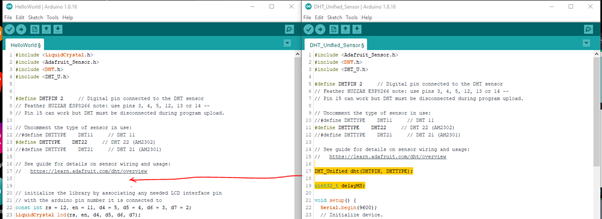

Copy the variables and library initializer values.
Again check that there are no variables with the same names and/or different values.

This is the section copied from the right file to the left file:

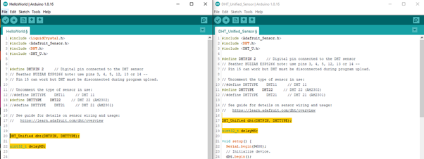

Next section is the Setup:

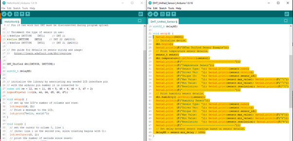

**Note:** The contents of the Setup are copied, but **not** the:


Or the:

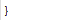

at the end.

This is the section copied from the right file to the left file:

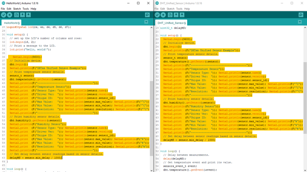

Next is the loop:

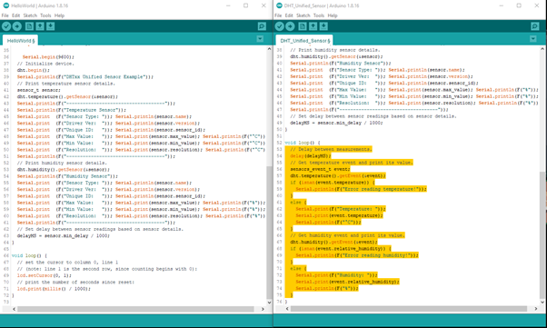

> **Note**: Copy the contents of the `loop()` function but **not** the `void loop()` declaration or the final closing brace.

```cpp
void loop() {
```

Or the closing brace:

```cpp
}
```

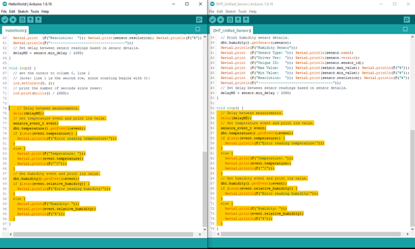

The two sketches are combined.

If you now run Verify, the sketch on the left should be able to compile.

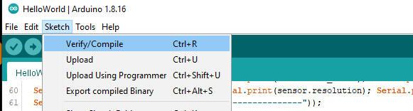

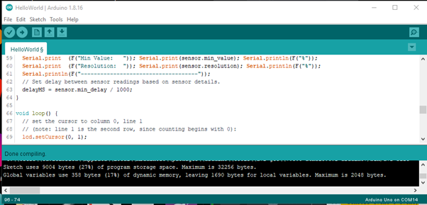

This combined sketch is complete except for changing the code to use both sketches' features.

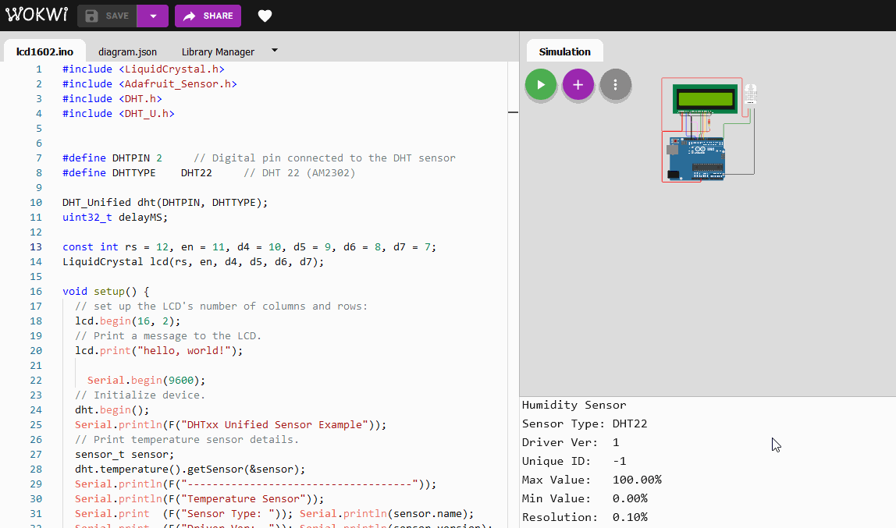

In this case, using the LCD to display the temperature and humidity readings.

---

[← Back to Home](../index.md)
