# Combining Sketches  | [HOME](README.md) |

When combining two or more sketches, it is VERY important that you understand the various sections of the sketch,
the next part of this guide is describing these sections.

You can skip over this, then come back later and read it when your combined sketches don’t work.

# Arduino basic sketches have sections

## Block comments

These can appear anywhere in the code but usually appear at the top with the author, description etc.

**Example**


The block comments start with /\*and end with\*/

A single line comment starts with //

When combining sketches, you can ignore the comment lines and comment blocks if you want as Arduino code ignores these.

## Libraries Include Section

This section appears at the very top of the sketch.

### note

##### *(there are some VERY special cases where a library may have a directive required before the library is loaded. This is very unusual but can happen.  It will appear as a #define XXXXXXX before the include library statement)*

The library load/include command is in the form of:

```#include <library file name>```
  
This will load and include the library if it is in the standard library path. If you load a library using the library manager, then the library will be in the correct place to be loaded with this statement.

In special cases, the library include statement might be in the form of:

```#include "library file name"```

In this case the library file is not in the normal location.

If it is in the same directory as the sketch, then it will use this format.

*It may also have the full path to the file as well, but this is a special case.*

## Definition Section

Usually, a sketch will have constants here. These are variables that do not change.

**Example**

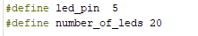

### Note

##### *there are no semi colons after a define.*

## Global Variables

A variable that changes and is used though out the sketch has a global scope. This means the variable can be accessed anywhere in the sketch.

**Example**


## Functions

This is a section that may or not be in the sketch. Usual coding practice is to have any functions that are used in the sketch located here.

These functions may be simple or complex.

**Example**

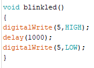

In the program, you would call this function with

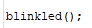

## Setup

This is a special section that runs once when the Arduino starts.

In this there are commands to start devices and or libraries.

Setup serial ports basically anything that needs to be done ONCE when the Arduino starts

**Example**

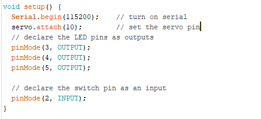

## Loop

This is the section that runs all the time after setup.

Once setup has run, loop runs continuously. This is where your main code will be.

**Example**


In this lesson on combining sketches, we will be using two sketches from the examples for two libraries.

One from LiquidCrytstal Library


The other from Adafruit DHT Sensor Library


This is the first file   DHT_Unified_Sensor

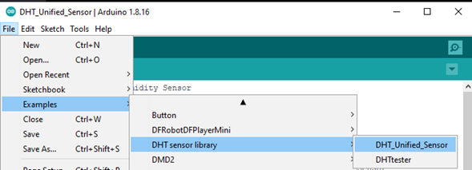

This is the second file Hello World

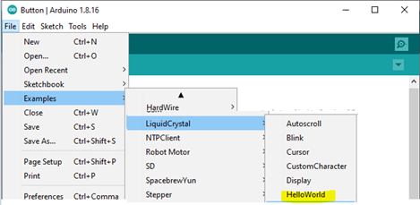

These files are accessible via the file, examples menu as shown – **AFTER you load the libraries using the library manager**

Here are the two files side by side. With the IDE you can open two files and set them up, side by side. Basically open the IDE twice.


in each file there is a large comments block. To tidy up, we will remove them. This is optional.

This gives us the two files – in a form that is a little easier to work on


First up, we copy the library load section


This is the section copied from right file to left file


The next section is the Definition Section

In these particular files, there are definitions in one file. We copy from the right side to the left side sketch.
Checking that there are no definitions with the same names and or different values.


This is the section copied from right file to left file

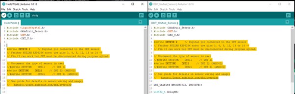

Next is the Global Variables Section

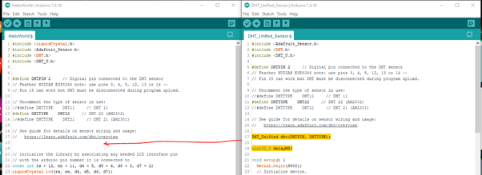

Copy the variables and library initializer values
Again checking that there are no variables with the same names and or different values.

This is the section copied from right file to left file


Next section is the  Setup

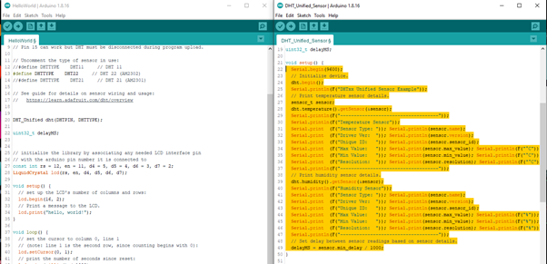

NOTE:  The contents of the Setup as copied but NOT the


Or the

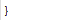

at the end.

This is the section copied from right file to left file


Next is the loop

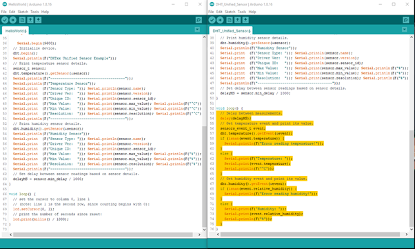

NOTE:  The contents of the loop are copied but NOT the

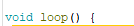

Or the


at the end.


The two sketches are combined.

If you now run verify, the sketch on the left should be able to verify

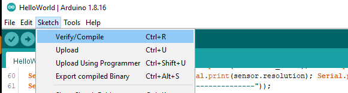


This combined sketch is complete except for changing the code to use both sketches features

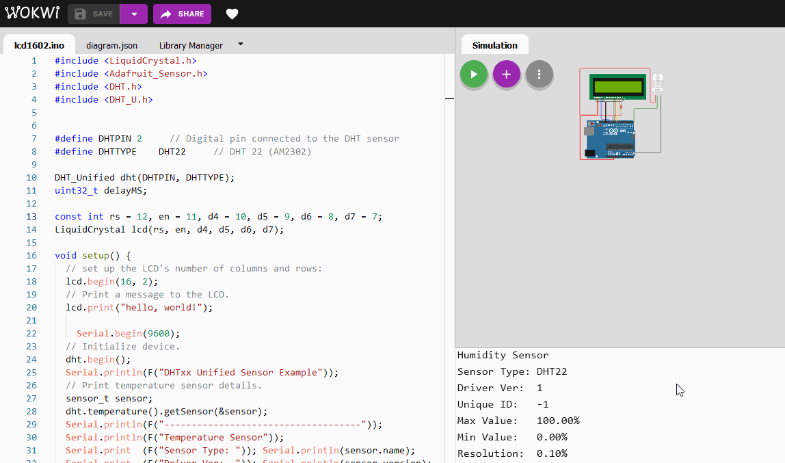

In this case, using the LCD to display the temperature and humidity readings
