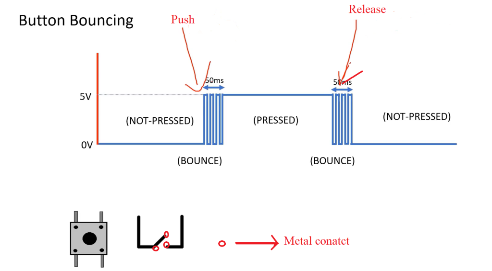
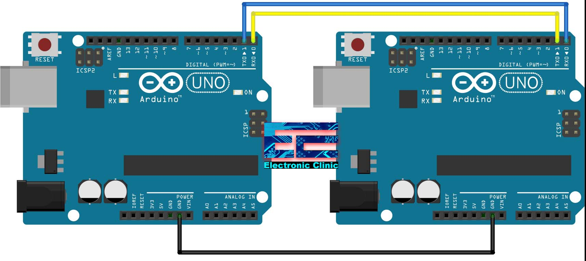
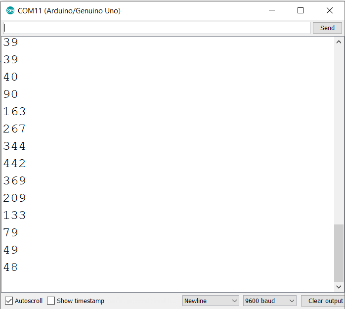
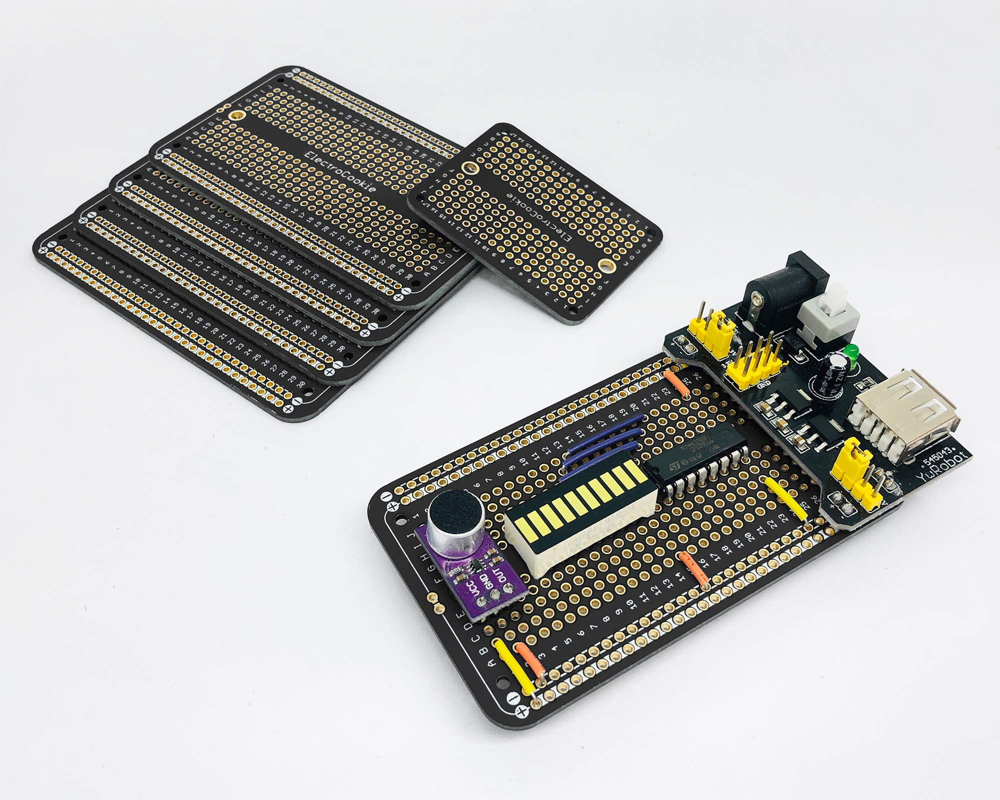

[← Back to Home](../index.md)

## Frequently Asked Questions (Arduino)

Below are 20 frequently asked questions about Arduino — 10 of the most commonly searched questions plus 10 other commonly asked/practical topics. Each question has a short, practical answer and links where relevant.

### Table of contents

- [Frequently Asked Questions (Arduino)](#frequently-asked-questions-arduino)
  - [Table of contents](#table-of-contents)
  - [1. What is an Arduino and which board should I buy first? {#1-what-is-an-arduino-and-which-board-should-i-buy-first}](#1-what-is-an-arduino-and-which-board-should-i-buy-first-1-what-is-an-arduino-and-which-board-should-i-buy-first)
  - [2. How do I install the Arduino IDE? {#2-how-do-i-install-the-arduino-ide}](#2-how-do-i-install-the-arduino-ide-2-how-do-i-install-the-arduino-ide)
  - [3. How do I upload a sketch to my Arduino? {#3-how-do-i-upload-a-sketch-to-my-arduino}](#3-how-do-i-upload-a-sketch-to-my-arduino-3-how-do-i-upload-a-sketch-to-my-arduino)
  - [4. Why is my Arduino not detected by my computer? {#4-why-is-my-arduino-not-detected-by-my-computer}](#4-why-is-my-arduino-not-detected-by-my-computer-4-why-is-my-arduino-not-detected-by-my-computer)
  - [5. What's the difference between 5V and 3.3V boards? {#5-whats-the-difference-between-5v-and-33v-boards}](#5-whats-the-difference-between-5v-and-33v-boards-5-whats-the-difference-between-5v-and-33v-boards)
  - [6. How do I power an Arduino safely from a battery? {#6-how-do-i-power-an-arduino-safely-from-a-battery}](#6-how-do-i-power-an-arduino-safely-from-a-battery-6-how-do-i-power-an-arduino-safely-from-a-battery)
  - [7. What is a sketch? {#7-what-is-a-sketch}](#7-what-is-a-sketch-7-what-is-a-sketch)
  - [8. What are digital, analog, and PWM pins? {#8-what-are-digital-analog-and-pwm-pins}](#8-what-are-digital-analog-and-pwm-pins-8-what-are-digital-analog-and-pwm-pins)
  - [9. Why does my circuit reset when I connect a component? {#9-why-does-my-circuit-reset-when-i-connect-a-component}](#9-why-does-my-circuit-reset-when-i-connect-a-component-9-why-does-my-circuit-reset-when-i-connect-a-component)
  - [10. How do I use libraries in Arduino sketches? {#10-how-do-i-use-libraries-in-arduino-sketches}](#10-how-do-i-use-libraries-in-arduino-sketches-10-how-do-i-use-libraries-in-arduino-sketches)
  - [11. What's the easiest way to learn electronics for Arduino? {#11-whats-the-easiest-way-to-learn-electronics-for-arduino}](#11-whats-the-easiest-way-to-learn-electronics-for-arduino-11-whats-the-easiest-way-to-learn-electronics-for-arduino)
  - [12. How do I read a sensor value and display it? {#12-how-do-i-read-a-sensor-value-and-display-it}](#12-how-do-i-read-a-sensor-value-and-display-it-12-how-do-i-read-a-sensor-value-and-display-it)
  - [13. What is debounce and why do I need it for buttons? {#13-what-is-debounce-and-why-do-i-need-it-for-buttons}](#13-what-is-debounce-and-why-do-i-need-it-for-buttons-13-what-is-debounce-and-why-do-i-need-it-for-buttons)
  - [14. How can I power motors without damaging my Arduino? {#14-how-can-i-power-motors-without-damaging-my-arduino}](#14-how-can-i-power-motors-without-damaging-my-arduino-14-how-can-i-power-motors-without-damaging-my-arduino)
  - [15. Can I connect multiple Arduinos together? {#15-can-i-connect-multiple-arduinos-together}](#15-can-i-connect-multiple-arduinos-together-15-can-i-connect-multiple-arduinos-together)
  - [16. Why does my analogRead return noisy values? {#16-why-does-my-analogRead-return-noisy-values}](#16-why-does-my-analogread-return-noisy-values-16-why-does-my-analogread-return-noisy-values)
  - [17. How do I update firmware on newer boards (e.g., ESP32, SAMD)? {#17-how-do-i-update-firmware-on-newer-boards-eg-esp32-samd}](#17-how-do-i-update-firmware-on-newer-boards-eg-esp32-samd-17-how-do-i-update-firmware-on-newer-boards-eg-esp32-samd)
  - [18. What are good practices for prototyping vs production? {#18-what-are-good-practices-for-prototyping-vs-production}](#18-what-are-good-practices-for-prototyping-vs-production-18-what-are-good-practices-for-prototyping-vs-production)
  - [19. How do I troubleshoot a non-working sketch? {#19-how-do-i-troubleshoot-a-non-working-sketch}](#19-how-do-i-troubleshoot-a-non-working-sketch-19-how-do-i-troubleshoot-a-non-working-sketch)
  - [20. Can I use Arduino with Python or other languages? {#20-can-i-use-arduino-with-python-or-other-languages}](#20-can-i-use-arduino-with-python-or-other-languages-20-can-i-use-arduino-with-python-or-other-languages)

---

### 1. What is an Arduino and which board should I buy first? {#1-what-is-an-arduino-and-which-board-should-i-buy-first}

Arduino is an open-source electronics platform combining easy-to-use hardware (microcontroller boards) and software (Arduino IDE and libraries). For beginners, the Arduino Uno (or a well-supported compatible) is the safest choice due to extensive documentation and community support.

Official site: https://www.arduino.cc/

---

### 2. How do I install the Arduino IDE? {#2-how-do-i-install-the-arduino-ide}

Download the Arduino IDE or use the Arduino CLI from the official Arduino downloads page. Choose your OS installer (Windows/macOS/Linux) and follow the installer steps. On Windows, install the USB driver when prompted or use an admin installer.

https://www.arduino.cc/en/software

---

### 3. How do I upload a sketch to my Arduino? {#3-how-do-i-upload-a-sketch-to-my-arduino}

Connect your board with a data-capable USB cable (some cables are power only), open the Arduino IDE, select the correct board model and serial port (Tools → Board / Port), open a sketch, then press Upload. The message 'Done uploading' indicates success.
If you can not see the port, then go to the next FAQ number 4.

---

### 4. Why is my Arduino not detected by my computer? {#4-why-is-my-arduino-not-detected-by-my-computer}

Common causes:
- Faulty or power-only USB cable (use a data cable)
- Missing USB driver (install from vendor)
- Wrong port selected in the IDE
- Defective USB-to-serial chip on some clones
- Need to install drivers for your clone (arduinos dont need drivers)
  - [if you have a CH340 chip](https://sparks.gogo.co.nz/ch340.html)
  - [if you have the 210 chip on your board](https://www.silabs.com/software-and-tools/usb-to-uart-bridge-vcp-drivers?tab=downloads)
  -  that may require specific drivers")

Try another cable/port, update drivers, and check Device Manager (Windows) or dmesg/lsusb (Linux/macOS).

---

### 5. What's the difference between 5V and 3.3V boards? {#5-whats-the-difference-between-5v-and-33v-boards}

5V boards (Arduino Uno, Mega) use 5V logic. Many modern boards (ESP32, some SAMD) use 3.3V logic. Never connect a 5V output directly to a 3.3V input — use a [level shifter](../hardwareGuides/logiclevel.md) or voltage divider to avoid damaging components.

---

### 6. How do I power an Arduino safely from a battery? {#6-how-do-i-power-an-arduino-safely-from-a-battery}

Use a regulated power source. For an Uno, you can supply 7–12V to VIN (onboard regulator) or 5V to the 5V rail if regulated. For portability, USB power banks or a regulated LiPo + voltage regulator are common. Always observe polarity and common ground when connecting external supplies.

---

### 7. What is a sketch? {#7-what-is-a-sketch}

A sketch is an Arduino program, usually written in C/C++. It has two main functions: setup() — runs once, and loop() — repeats continuously. Sketches are compiled and uploaded to the board.

Arduino reference on structure: https://www.arduino.cc/reference/en/language/structure/

---

### 8. What are digital, analog, and PWM pins? {#8-what-are-digital-analog-and-pwm-pins}

- Digital pins: read/write HIGH or LOW (0/1).
- Analog input pins: read variable voltage via ADC (analogRead).
- PWM pins: digital pins that support pulse-width modulation to simulate varying voltage for dimming LEDs or controlling motor speed (analogWrite on some boards).

Arduino I/O reference: https://www.arduino.cc/reference/en/language/functions/analog-io/

---

### 9. Why does my circuit reset when I connect a component? {#9-why-does-my-circuit-reset-when-i-connect-a-component}

This usually indicates a power issue — the component draws excessive current or there's a short. Check wiring carefully, ensure your power supply can provide required current, add decoupling capacitors, and test components individually. Your last step is, unhook all wires, let it cool for a minute powered down, then see if it's still functioning with the blink example.

---

### 10. How do I use libraries in Arduino sketches? {#10-how-do-i-use-libraries-in-arduino-sketches}

Install libraries via the Arduino IDE's Library Manager (Sketch → Include Library → Manage Libraries) or place them in your sketchbook `libraries/` folder. Then include the header with `#include <LibraryName.h>` and review the library's examples.

https://www.arduino.cc/en/Guide/Libraries

---

### 11. What's the easiest way to learn electronics for Arduino? {#11-whats-the-easiest-way-to-learn-electronics-for-arduino}

Begin with simple components: LEDs, resistors, buttons, and a breadboard. Follow step-by-step tutorials that explain basic concepts such as Ohm's law, series/parallel circuits, and safe wiring. Hands-on projects teach faster than theory alone.

---

### 12. How do I read a sensor value and display it? {#12-how-do-i-read-a-sensor-value-and-display-it}

Determine whether the sensor outputs analog or digital. Use `analogRead()` for analog sensors or `digitalRead()` for digital sensors. Use `Serial.print()` to view values in the Serial Monitor, or send values to an LCD/OLED display or web dashboard depending on your board.

---

### 13. What is debounce and why do I need it for buttons? {#13-what-is-debounce-and-why-do-i-need-it-for-buttons}

Mechanical switches produce noisy transitions when toggled. Debouncing (software delay, state filtering, or hardware RC filtering) prevents multiple triggers from a single press. See the Arduino debounce example for patterns.

Debounce example: https://www.arduino.cc/en/Tutorial/BuiltInExamples/Debounce

[Go to this page for more info on buttons.](../hardwareGuides/buttons.md)

---

### 14. How can I power motors without damaging my Arduino? {#14-how-can-i-power-motors-without-damaging-my-arduino}

Motors draw high current and can generate electrical noise. Use a separate motor power supply, common ground with the Arduino, and motor drivers or H-bridges rated for your motor. Add flyback diodes for DC motors and capacitors for noise suppression.

---

### 15. Can I connect multiple Arduinos together? {#15-can-i-connect-multiple-arduinos-together}

Yes. You can use serial (UART), I2C, or SPI to communicate between microcontrollers. Decide on a master/slave or peer architecture and handle addressing and clocking carefully. Ensure voltage levels match between boards.

---

### 16. Why does my analogRead return noisy values? {#16-why-does-my-analogRead-return-noisy-values}

Analog values can fluctuate due to electrical noise, poor grounding, or high source impedance. Use averaging (multiple samples), smoothing filters, proper grounding, and keep analog wiring away from high-current traces. 

---

### 17. How do I update firmware on newer boards (e.g., ESP32, SAMD)? {#17-how-do-i-update-firmware-on-newer-boards-eg-esp32-samd}

Many boards can be flashed from the Arduino IDE. Some platforms (ESP) use tools like [esptool.py](https://docs.espressif.com/projects/esptool/en/latest/esp32/) for advanced flashing. Follow the board vendor's flashing instructions, and ensure the correct boot mode or bootloader is used for your board.

---

### 18. What are good practices for prototyping vs production? {#18-what-are-good-practices-for-prototyping-vs-production}

Prototype on a breadboard or solderless perfboard. When moving to production:

- Move to soldered connections or a PCB
- Use reliable power supplies and connectors
- Add protection components (fuses, TVS diodes) where appropriate
- Consider enclosures and thermal management  [find them here](https://www.amazon.com/stores/ElectroCookieInc/page/B11DB0B2-E282-43CA-AC4D-2D1349C983E7?)

---

### 19. How do I troubleshoot a non-working sketch? {#19-how-do-i-troubleshoot-a-non-working-sketch}

Use `Serial.print()` to trace program flow and variable values, isolate hardware by testing components individually, try a known-good example sketch, and simplify your code to the smallest failing case.

---

### 20. Can I use Arduino with Python or other languages? {#20-can-i-use-arduino-with-python-or-other-languages}

Yes. Standard Arduinos can communicate over serial with Python (using `pyserial`). Some boards (ESP32, some microcontrollers) can run MicroPython or CircuitPython directly. Use the toolchain that best fits your workflow. **NOTE that all of thease option are NOT industry standard, they are limiting, they only work on some MCU's, and genarly not supported.**

[← Back to Home](../index.md)
