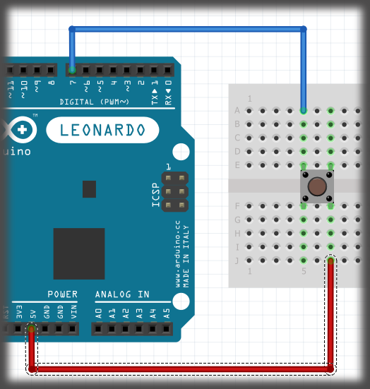

# Basic Guide To Buttons { .text-[#e67e22] }

## Button Basics 🔲

A standard button is "open" until you press the button. At that point, the two parts of the button make contact, and the button is said to be "closed".

Using a button in this manner is called "normally open". This means that when the button is NOT pressed, there is no connection from one side to the other.

## When we use a button with a microcontroller, there are a few challenges to deal with. First is the wiring

### *The wiring for a button is:*

* Side-A of the button is connected to the Arduino pin.
  * **EXAMPLE A**
* Side-B of the button is connected to VCC, or 5 V/3.3 V {depending on the Arduino you are using.}
  * **EXAMPLE B**
* Side-A is also connected to a resistor. The resistor value is between 1 kΩ and 10 kΩ. Any value in between will work.
  * **EXAMPLE C**
* The other side of the resistor is then connected to ground.
  * **EXAMPLE D**

Using this wiring, the resistor is said to be a "pull-down" resistor. This simply means that the resistor is pulling the Arduino pin to GND when the button is NOT pressed.

|                             EXAMPLE A                              |                                  EXAMPLE B                                   |                                  EXAMPLE C                                  | EXAMPLE D                                                                       |
| :----------------------------------------------------------------: | :--------------------------------------------------------------------------: | :-------------------------------------------------------------------------: | ------------------------------------------------------------------------------- |
|  |  |  |  |

When you first start working with buttons, it's best to select 2 pins that are diagonal from each other. Until you understand how a button is oriented, this is the easiest way of making sure you wire the button correctly. There is some test code that will test if you have the button wired correctly, and that it's functioning.

## CODE

```cpp
// the button is connected to pin seven so that's what the below line does.
byte buttonPin = 7;

void setup(){
    Serial.begin(9600);
    pinMode(buttonPin, INPUT);

}

void loop(){
    bool state = digitalRead(buttonPin);

    if (state == HIGH){
        Serial.println("\n \n \n \n \n \n Button is pressed");
    }else{
        Serial.println("\n \n \n \n \n \n Button is NOT pressed");
    }
}
```

If your serial monitor does NOT respond correctly, you most likely have a wiring problem. Check the wiring to make sure it's like the examples above. If you're getting random readings despite not touching the button, it's most likely due to a wiring problem.

---

## **WARNING**⚠️

If the LEDs on the Arduino board turn OFF every time you press the button, OR if when you CONNECT the button, you have a short, do not operate the Arduino in this case. Pull all of the wires from the Arduino so no wires are connected to it other than the USB. If the LED lights up again, then you need to rewire the button over again.

If you look at a diagram, a button is shown by a broken line. If you look at the image below, you can see what the same wiring diagram looks like in a SCHEMATIC example.


---


