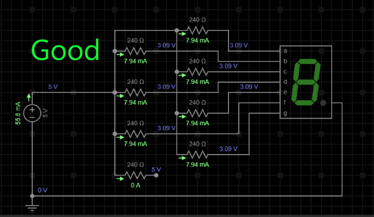
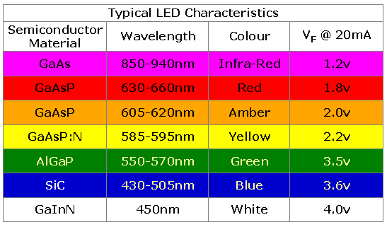

# Resistors { .text-[#e67e22] }

[← Back to Home](../index.md)

*This page is about resistors and LEDs*

## An LED is short for Light Emitting Diode

Diodes are devices that let electricity flow only in one direction. LEDs work the same way, as they are also diodes.

20 mA or less. Although they may try and pass the full current, doing so will cause damage to the LED, or shorten its performance efficiency (or damage/shorten the life of the Arduino pin).

To stop this from happening, we use a resistor. This limits the amount of current flowing through the LED, so it lights and doesn't burn out.

---

## Correct Wiring

It does not matter, for a single LED, whether you apply the resistor to the GND or the power side. So this is how you would wire a standard LED *(both are correct)*.

---

## Seven Segment Displays

Seven segment displays are a specific case. You are required to have your resistors on every segment of the display. This means it requires 7-8 resistors (depending upon whether your display uses a decimal point or not).

---

You do not want to use a resistor on the common pin of the display.

The reason for this is found in the math.
If you look at the example above, you can see that each segment only has 8 mA passing through it. It does not matter if one segment is lit, or if all seven are. Each one is limited and controlled to 8 mA.

If you place a resistor on the common pin, then the current will change each time a segment is lit.

With one segment lit, there will be 8 mA passing through it.
When you light two, then the segments will get dimmer, because there is only 4 mA passing through each one.

If you light all eight segments, then you will only have 1 mA passing through each one. This is why we do not use a resistor on the single common pin.

## LED Color Matters

Each LED has a *forward voltage.* *Forward voltage* is the required voltage level that the LED needs before it starts conducting current through it.

Below is a chart of the common colors, with their forward voltage requirements. If you can find a data sheet for your LED, it is best to go by that.
If not, the chart will assist you in your resistor math.

## Resistor Math Time

### *We will see an example of voltage drop*

If you have a supply voltage of 5 V, and you have a red LED, we will say the forward voltage is 2.0 V. First we subtract the (forward voltage) from the total voltage. So it would look like this.

## **Vcc-Fv-Rv**

> * **Vcc** is the main voltage [we will use 5 V for our example]
> * **Fv** is the forward voltage needed for the LED.
> * **Rv** is the voltage you use to calculate the resistor you need.
> * So in our example the math would be:
>
> * ### 5 V - 2 V = 3 V
>
> * So the final value is **3 V / 0.02 A = 150**
> * 150 ohm resistor is needed.

This is required so the LED will not burn out faster than expected.

And so we do not damage the Arduino/components in the circuit.

As you can see, the perfect resistor value would be 150 Ohms. If you don't have a resistor of the calculated value, you can use the next size larger than it.
Another option is to use two smaller resistors end to end \(in series\) and use them in place of the single resistor.

> **Note**: *A 220 ohm resistor and a 220 ohm resistor can make a 440 ohm resistor.*
>
> **Note**: There is also a [resistor calculator](https://ohmslawcalculator.com/led-resistor-calculator "resistor online calculator") you can use, if you have the data for your LED
---
[← Back to Home](../index.md)
