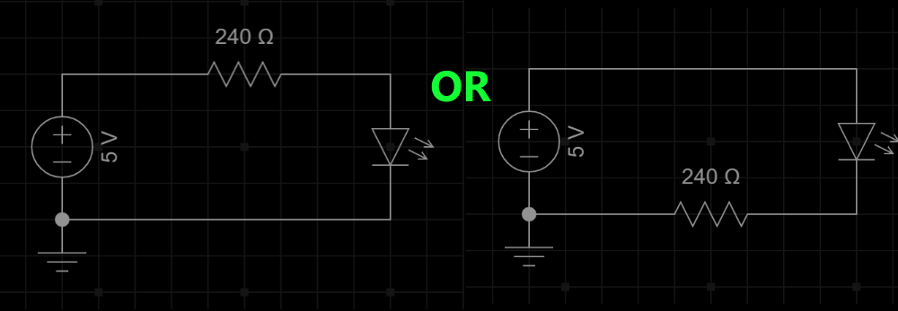
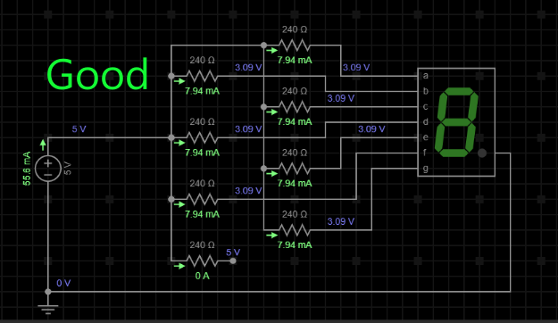
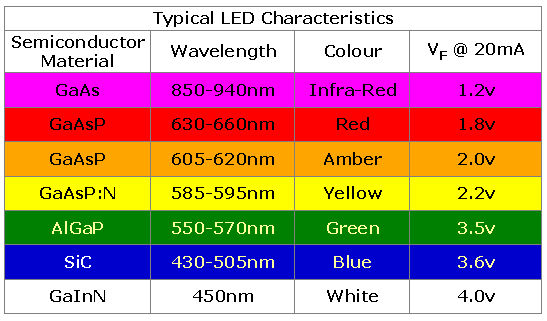
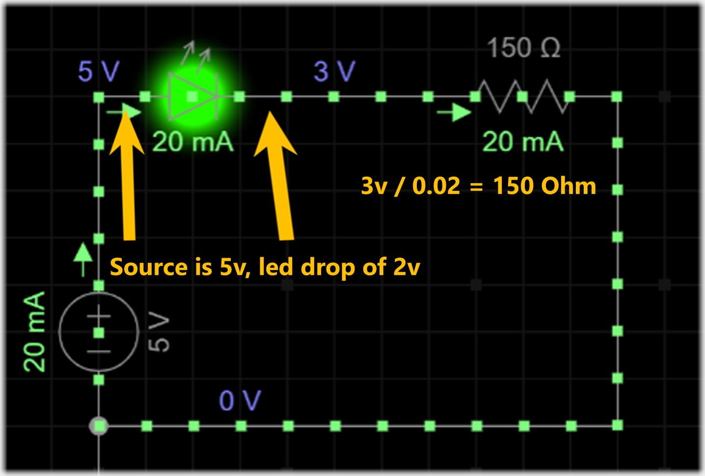
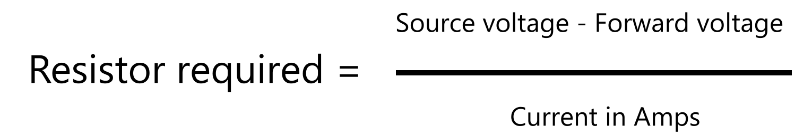

# Resistors

Related pages: [Breadboard](./breadBoard.md), [Nine Volts](./nineVolts.md), [Multimeter](./multimeter.md).

[← Back to Home](../index.md)

*This page is about resistors and LEDs.*

## An LED is short for Light Emitting Diode

Diodes are devices that let electricity flow only in one direction. LEDs work the same way, as they are also diodes.

> ⚠️ **LED Polarity Warning**: LEDs are diodes and only conduct electricity in one direction. Applying reverse polarity (connecting the LED backwards) can instantly destroy the LED. Always ensure the longer leg (anode/positive) connects to the power side and the shorter leg (cathode/negative) connects to ground. Reversing the polarity can cause immediate failure.

An LED should receive 20 mA or less. Although it may try to pass the full current, doing so will cause damage to the LED, shorten its performance efficiency, or damage the Arduino pin.

To stop this from happening, we use a resistor. This limits the amount of current flowing through the LED so it lights up and doesn't burn out.

---

## Correct Wiring

For a single LED, it does not matter whether you apply the resistor to the GND or the power side. Both of the following wiring configurations are correct:

---

Seven-segment displays are a specific case. You are required to have resistors on every segment of the display. This means it requires 7–8 resistors (depending upon whether your display uses a decimal point or not).

---

You do **not** want to use a resistor on the common pin of the display.

The reason for this is found in the math.
If you look at the example above, you can see that each segment only has 8 mA passing through it. It does not matter if one segment is lit or if all seven are — each one is limited and controlled to 8 mA.

If you place a resistor on the common pin, the current will change each time a segment is lit.

With one segment lit, there will be 8 mA passing through it.
When you light two, the segments will get dimmer because there is only 4 mA passing through each one.

If you light all eight segments, you will only have 1 mA passing through each one. This is why we do not use a resistor on the single common pin.

## LED Polarity Reference

Identifying LED polarity is crucial for proper operation:

- **Longer leg = Anode (Positive, connects to power/resistor)**
- **Shorter leg = Cathode (Negative, connects to ground)**
- **Flat edge on LED housing = Cathode side**

> **Note**: A polarity reference diagram image (`ledPolarity.png`) was referenced here but is not yet present in the assets directory. Ensure the file is added to `../../assets/images/forwardVoltage/` to display the visual guide.

---

## LED Color Matters

Each LED has a *forward voltage* — the required voltage level that the LED needs before it starts conducting current.

Below is a chart of the common colors with their forward voltage requirements. If you can find a data sheet for your LED, it is best to go by that.
If not, the chart will assist you in your resistor math.

## Resistor Math Time

### *We will see an example of voltage drop*

If you have a supply voltage of 5 V and a red LED, we will say the forward voltage is 2.0 V. First we subtract the forward voltage from the total voltage. It would look like this:

### Vcc − Fv = Rv

> - **Vcc** is the main voltage (we will use 5 V for our example)
> - **Fv** is the forward voltage needed for the LED
> - **Rv** is the voltage you use to calculate the resistor you need
> - So in our example the math would be:
>
> **5 V − 2 V = 3 V**
>
> Then: **3 V / 0.02 A = 150**
>
> A **150 ohm resistor** is needed.

This is required so the LED will not burn out faster than expected, and so we do not damage the Arduino or other components in the circuit.

As you can see, the perfect resistor value would be 150 Ohms. If you don't have a resistor of the calculated value, you can use the next size larger than it.

> **Note on Resistor Values**: Standard resistors come in specific value series (E12 or E24). The E12 series includes values like 10, 12, 15, 18, 22, 27, 33, 39, 47, 56, 68, 82 (multiplied by powers of 10). The E24 series provides even finer tolerance values. "Next size larger" refers to the next value in these standard series, not just the next integer. For example, after 150 Ω, the next E12 size is 180 Ω, and the next E24 size is 160 Ω.
>
> **Note**: Two 220 ohm resistors in series can make a 440 ohm resistor.
>
> **Note**: There is also a [resistor calculator](https://ohmslawcalculator.com/led-resistor-calculator "Resistor online calculator") you can use if you have the data for your LED.

---

[← Back to Home](../index.md)
