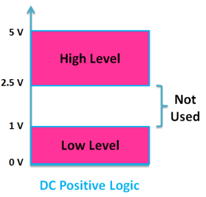

# What are logic levels { .text-[#e67e22] }

## Introduction

In digital circuits, a logic level is one of a finite number of states that a digital signal can inhabit. Logic levels are usually represented by the voltage difference between the signal and ground, although other standards exist. The range of voltage levels that represent each state depends on the logic family being used. A logic-level shifter can be used to allow compatibility between different circuits.

## Logic Levels

### 2-logic levels

The two levels are also used in digital communication to represent the two possible states of a bit.
In binary logic the two levels are logical high and logical low, which generally correspond to binary numbers 1 and 0 respectively or truth values true and false respectively. Signals with one of these two levels can be used in boolean algebra for digital circuit design or analysis.

### **Active States**

The use of either the higher or the lower voltage level to represent either logic state is arbitrary. The two options are active high (Logic High) and active low (Logic Low). Active-high and active-low states can be mixed at will: for example, a read only memory integrated circuit may have a chip-select signal that is active-low, but the data and address bits are conventionally active-high. Occasionally a logic design is simplified by inverting the choice of active level.
    
Binary signal representations   
| Logic level | Active HIGH | Active Low |
| :---: | :---: | :---: |
| 0 | 0V | 5V |
| 1 | 5V | 0V |

### **Arduino Logic Levels**

If the voltage is Less than 1.8V, the Arduino will interpret the signal as a LOW. If the voltage is greater than 3.3V, the Arduino will interpret the signal as a HIGH. If the voltage is between 1.8V and 3.3V, the Arduino will interpret the signal as a HIGH if the voltage is closer to 3.3V and LOW if the voltage is closer to 1.8V.

::: info NOTE
If the voltage is between 1.8 and 3.3V, the Arduino will fluctiate between HIGH and LOW.
:::