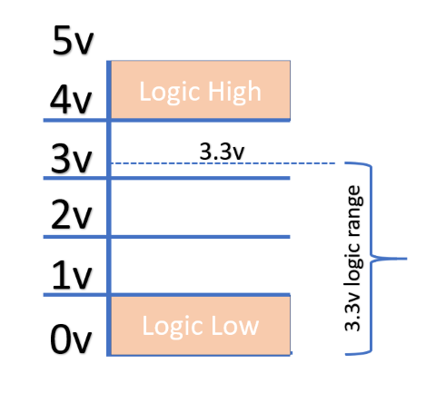

# What are Logic Levels { .text-[#e67e22] }

## Introduction

In digital circuits, a logic level is one of a finite number of states that a digital signal can inhabit. Logic levels are usually represented by the voltage difference between the signal and ground, although other standards exist. The range of voltage levels that represent each state depends on the logic family being used. A logic-level shifter can be used to allow compatibility between different circuits.

## Logic Levels

### 2-State Logic Levels

The two levels are also used in digital communication to represent the two possible states of a bit. In binary logic, the two levels are logical high and logical low, which generally correspond to binary numbers 1 and 0, respectively, or truth values true and false. Signals with one of these two levels can be used in Boolean Algebra for digital circuit design or analysis.

### Active States

The use of either the higher or the lower voltage level to represent a logic state is arbitrary. The two options are active high (Logic High) and active low (Logic Low). Active-high and active-low states can be mixed at will: for example, a read-only memory integrated circuit may have a chip-select signal that is active-low, but the data and address bits are conventionally active-high. Occasionally, a logic design is simplified by inverting the choice of active level.

#### Binary Signal Representations

| Logic Level | Active HIGH | Active LOW |
| :---: | :---: | :---: |
| 0 | 0V | 5V |
| 1 | 5V | 0V |

### Arduino Logic Levels for a 5V MCU

If the voltage is between 1.2 V and 3.8 V, the Arduino will behave unpredictably, and can randomly read as either high or low.

::: info NOTE

If the voltage is between 1.2V and 3.8V, the Arduino may fluctuate between HIGH and LOW.
:::

---

# Bi-directional Logic Level Shifters { .text-[#27ae60] }

## What is a Logic Level Shifter?

A logic level shifter is a circuit that safely steps signals up or down between devices operating at different voltages. For example, many sensors and modules use 3.3V logic, while classic Arduino boards use 5V logic. Connecting them directly can damage components or cause unreliable operation.

**Bi-directional** logic level shifters allow signals to travel in both directions, making them ideal for protocols like I2C, where both devices can send and receive data.

## Why Do We Need Logic Level Shifters?

- **Protect sensitive components:** Prevents damage to 3.3V devices when connected to 5V logic.
- **Ensure reliable communication:** Avoids missed or misread signals due to voltage mismatches.
- **Enable compatibility:** Allows mixing of modern (3.3V) and legacy (5V) hardware.

## How to Wire a Bi-directional Logic Level Shifter

Here’s a typical wiring diagram for a BSS138-based bi-directional level shifter (commonly used for I2C):

**Wiring Steps:**
1. Connect the HV (high voltage) pin to your 5V device’s logic voltage.
2. Connect the LV (low voltage) pin to your 3.3V device’s logic voltage.
3. Connect GND to both device grounds.
4. Connect the signal lines (e.g., SDA/SCL for I2C) to the appropriate channels.

::: tip
Always double-check the datasheet or module markings for pinout!
:::

## Common Logic Level Shifter Modules

Here are some popular modules you can buy:

- **BSS138-based 4-channel bi-directional shifter**  
  [Amazon US](https://www.amazon.com/s?k=logic+level+shifter+bss138)
- **TXB0108 8-channel bi-directional shifter**  
  [Amazon US](https://www.amazon.com/s?k=txb0108)
- **74LVC245 8-channel shifter**  
  [Amazon US](https://www.amazon.com/s?k=74lvc245)

*Links are for convenience; always verify compatibility with your project.*

## Most Common Misunderstanding

A frequent mistake is thinking that a simple resistor voltage divider or a unidirectional shifter is always safe for I2C or bidirectional data lines.  
**I2C and some other protocols require bi-directional level shifting**—using a unidirectional shifter can break communication or even damage devices.

## Common Uses for Logic Level Shifters with Arduino

- Connecting 3.3V I2C sensors (e.g., BME280, OLED displays) to 5V Arduino boards
- Interfacing with SD cards (which use 3.3V logic)
- Communicating with ESP8266/ESP32 modules from a 5V Arduino
- Connecting 5V logic outputs to 3.3V microcontrollers or Raspberry Pi
- Shifting SPI, UART, or other digital signals between voltage domains
- **__Seeing someone do it on YouTube or other sites without a level shifter does not mean it is safe__**. Often, this is a misunderstanding, and there is no proof the project only worked poorly, was unstable, or never even worked at all—sometimes videos are edited.

---

## See Also

- [Official Arduino Documentation on Logic Levels](https://www.arduino.cc/en/Tutorial/Fundamentals/LogicLevels)
- [SparkFun Guide: Logic Level Shifting](https://learn.sparkfun.com/tutorials/logic-levels/all)

---

# Summary

Logic level shifters are essential for safely connecting devices that use different logic voltages. Bi-directional shifters are especially important for protocols like I2C. Always use the correct type of shifter for your application to avoid damaging your components.

---

[← Back to Main Page](../../index.md)